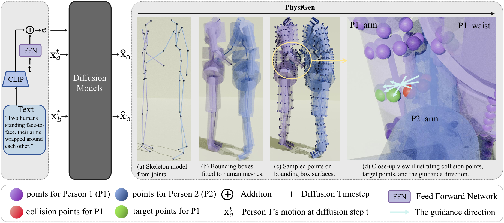

<div align="center">

# PhysiGen: Integrating Collision-Aware Physical Constraints for High-Fidelity Human-Human Interaction Generation

**Accepted to ICASSP 2026**

[Nan Lei](mailto:lein7@mail2.sysu.edu.cn), Yuan-Ming Li, Ling-An Zeng, Liang Xu,

Zhi-Wei Xia, Hui-Wen Huang, Fa-Ting Hong†, Wei-Shi Zheng

<sup>Sun Yat-sen University &nbsp;|&nbsp; The Hong Kong University of Science and Technology &nbsp;|&nbsp; Shanghai Jiao Tong University &nbsp;|&nbsp; Guilin University of Electronic Technology</sup>

†Corresponding author

</div>

---

## 📢 News

- **[2026.01.18]** 🎉 PhysiGen is accepted to **ICASSP 2026**!
- 🚧 Code and models coming soon...

---

## 📝 TODO

- ⬜ Release training & inference code
- ⬜ Release trained model checkpoints
- ⬜ Support plug-in integration with more generative models
- ⬜ One-click online demo

---

## 📑 Table of Contents

- [🔍 Overview](#overview)
- [🛠️ Installation](#installation)
- [📊 Results](#results)
- [📄 Citation](#citation)
- [📜 License](#license)
---

## 🔍 Overview

<div align="center">

</div>

> **PhysiGen** is a plug-and-play, computationally efficient optimization strategy that explicitly integrates collision-aware physical constraints into human-human interaction generation.

Generating realistic multi-person interaction sequences remains challenging due to pervasive **body interpenetration** — a problem that spans from data acquisition to generated results. Existing approaches either ignore this issue or rely on computationally expensive mesh-level SDF losses (e.g., inflating training time from **3 days → 14 days**).

PhysiGen addresses this by:
- 🔷 **Simplifying** high-resolution human body meshes into geometric primitives (cylinders/cuboids) for efficient collision detection
- 🔷 **Computing** physics-inspired guidance directions via antipodal point construction to resolve penetration
- 🔷 **Integrating** seamlessly into existing models as a plug-and-play module — no architectural changes required

**Key results on InterHuman & Inter-X:**
| Model | Collision Distance ↓ | Collision Rate ↓ | Top-1 R-Precision ↑ |
|---|---|---|---|
| InterGen | 3.905 | 0.2270 | 0.371 |
| InterGen + PhysiGen | **1.836** | **0.1878** | **0.485** |
| in2IN | 3.142 | 0.1863 | 0.455 |
| in2IN + PhysiGen | **2.005** | **0.1503** | **0.481** |

---

## 🛠️ Installation

Clone the repository and set up the environment:

```bash
git clone https://github.com/iSEE-Laboratory/PhysiGen.git
cd PhysiGen
```

Create conda environment:

```bash
conda create -n physigen python=3.9
conda activate physigen
```

Install dependencies:

```bash
pip install -r requirements.txt
```

---

## 📋 Prerequisites

### Download Assets & Checkpoints

Download the required assets and pretrained checkpoints:

```bash
bash scripts/download_assets.sh
```

### Datasets

We evaluate on two datasets:

- **InterHuman** — 7,779 two-person interaction sequences with text annotations. Download from [InterGen](https://github.com/tr3e/InterGen).
- **Inter-X** — 11,388 interaction sequences using SMPL-X. Download from [Inter-X](https://github.com/liangxuy/Inter-X).

Organize the data as follows:

```
data/
├── InterHuman/
│   ├── motions/
│   └── texts/
└── Inter-X/
    ├── motions/
    └── texts/
```

---

## ▶️ Usage

### 🏋️ Training

**Train from scratch** (PhysiGen integrated into full training):

```bash
conda activate physigen
python train.py --dataset interhuman --mode scratch
```

**Adaptation** (fine-tune a pretrained model with PhysiGen):

```bash
conda activate physigen
python train.py --dataset interhuman --mode adaption --ckpt path/to/pretrained.ckpt
```

### 🎯 Inference

Generate interaction motions from text:

```bash
conda activate physigen
python generate.py --text "Two people shake hands and then hug each other." --output ./output
```

### 📏 Evaluation

Evaluate on the InterHuman test set:

```bash
conda activate physigen
python eval.py --dataset interhuman --ckpt path/to/checkpoint.ckpt
```

Evaluate on the Inter-X test set:

```bash
conda activate physigen
python eval.py --dataset inter-x --ckpt path/to/checkpoint.ckpt
```

### 👁️ Visualization

Visualize generated motion sequences:

```bash
conda activate physigen
python scripts/visualize.py --motion_path ./output/motion.npy --text "your text prompt"
```

---

## 📊 Results

### Quantitative Comparison

<div align="center">

</div>

### Qualitative Comparison

<div align="center">

</div>

PhysiGen significantly reduces interpenetration while maintaining semantic consistency with the text prompt. Red dashed boxes in the figure above highlight severe collision artifacts in baseline methods.

### Computational Cost

PhysiGen introduces minimal overhead compared to SDF-based losses:

| Method | Memory (MB) | Time per batch (s) |
|---|---|---|
| Baseline | 15,107 | — |
| PhysiGen (50×19 pts) | 20,219 | **0.053** |
| SDF Loss (128 pts) | 24,152 | 0.352 |
| SDF Loss (6890 pts) | 24,156 | 3.734 |

---

## 📄 Citation

If you find this work useful, please consider citing:

```bibtex
@article{lei2023physigen,
  title={PhysiGen: Integrating Collision-Aware Physical Constraints for High-Fidelity Human-Human Interaction Generation},
  author={Lei, Nan and Li, Yuan-Ming and Zeng, Ling-An and Xu, Liang and Xia, Zhi-Wei and Huang, Hui-Wen and Hong, Fa-Ting and Zheng, Wei-Shi},
  booktitle={IEEE International Conference on Robotics and Automation (ICRA)},
  year={2026}
}
```

---

## 📜 License

This project is released under the [Apache License 2.0](LICENSE).

---

## ⭐ Star History

[](https://star-history.com/#your-repo/PhysiGen&Date)

---

## 🙏 Acknowledgement

We thank the following open-source projects for their contributions to the community:

- [InterGen](https://github.com/tr3e/InterGen) — two-person interaction generation framework and InterHuman dataset
- [Inter-X](https://github.com/liangxuy/Inter-X) — large-scale human interaction dataset
- [in2IN](https://github.com/pabloruizponce/in2IN) — individual-aware interaction generation
- [TIMotion](https://github.com/your-link) — temporal and interactive motion generation framework
- [MDM](https://github.com/GuyTevet/motion-diffusion-model) — human motion diffusion model

---

<div align="center">
<sup>If you have any questions, please open an issue or contact us at lein7@mail2.sysu.edu.cn</sup>
</div>
```

---

几点说明：

1. **需要你补充的内容**：arXiv 链接、GitHub 仓库地址、项目主页链接、作者个人主页链接，以及 assets 文件夹中的图片（teaser、定量结果、定性结果图）。

2. **badge 链接**：`arXiv`、`Project Page` 的 URL 需替换为实际地址。

3. **Citation**：venue 已按 ICRA 2026 填写，bibtex key 和具体字段你可以按需调整。

4. **Star History**：将 `your-repo/PhysiGen` 替换为实际的 GitHub 仓库路径即可生效。
