<div align="center">

<!--  -->

# PhysiGen: Integrating Collision-Aware Physical Constraints for High-Fidelity Human-Human Interaction Generation

**Accepted to ICASSP 2026**

Nan Lei, Yuan-Ming Li, Ling-An Zeng, Liang Xu,
Zhi-Wei Xia, Hui-Wen Huang, Fa-Ting Hong†, Wei-Shi Zheng

<sup>Sun Yat-sen University &nbsp;|&nbsp; The Hong Kong University of Science and Technology &nbsp;|&nbsp; Shanghai Jiao Tong University &nbsp;|&nbsp; Guilin University of Electronic Technology</sup>

[](https://ieeexplore.ieee.org/document/11461453)
[](https://ieeexplore.ieee.org/document/11461453)
[](LICENSE)

</div>

<!-- ## 🎬 Demo -->

<!-- <div align="center">

**PhysiGen**

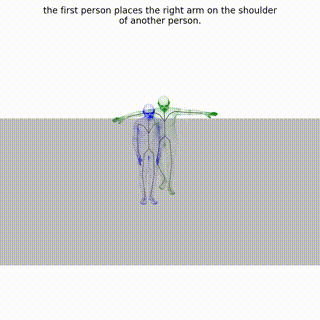    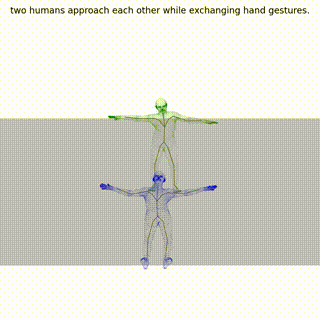 

      

     

</div> -->


## 📢 News


- **[2025.12.11]** 🎉 Check out our new work **IRG-MotionLLM** with &nbsp; &nbsp; ——the first model supporting natively text-motion interleaved reasoning for text-to-motion generation, with advanced performance and emerging cross-task, cross-model synergies!
  - 📄 [Paper](https://arxiv.org/abs/2512.10730) &nbsp;|&nbsp; 💻 [Code](https://github.com/HumanMLLM/IRG-MotionLLM)
- **[2026.01.18]** 🎉 PhysiGen is accepted to **ICASSP 2026**!
- 🚧 Code and models coming soon...

---

## 📝 TODO

- ✅ Release core computation code  
- ✅ Release core evaluation code  
- ⬜ Release full training and inference pipeline  
- ⬜ Release bounding box parameter files  
- ⬜ Release pretrained model checkpoints  

---

## 🔍 Overview

<div align="center">
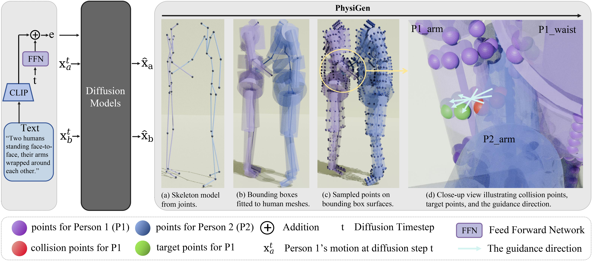
</div>

> **PhysiGen** is a computationally efficient optimization strategy that explicitly integrates collision-aware physical constraints into human-human interaction generation.

Generating realistic two-person interaction sequences remains challenging due to pervasive **body interpenetration** — a problem that spans from data acquisition to generated results. Existing approaches either ignore this issue or rely on computationally expensive mesh-level SDF losses (e.g., inflating training time from **3 days → 14 days**).

PhysiGen addresses this by:
- 🔷 **Simplifying** high-resolution human body meshes into geometric primitives (cylinders/cuboids) for efficient collision detection
- 🔷 **Computing** physics-inspired guidance directions via antipodal point construction to resolve penetration
- 🔷 **Integrating** seamlessly into existing models as a plug-and-play module — no architectural changes required

**Key results on InterHuman:**

| Model | Collision Distance ↓ | Collision Rate ↓ | Top-1 R-Precision ↑ |
|---|---|---|---|
| InterGen | 3.905 | 0.2270 | 0.371 |
| InterGen + PhysiGen(from scratch) | **1.836** | **0.1878** | **0.485** |
| in2IN | 3.142 | 0.1863 | 0.455 |
| in2IN + PhysiGen (adaption) | **2.005** | **0.1503** | **0.481** |

---

## 🛠️ Installation

Clone the repository and set up the environment:

```bash
git clone https://github.com/iSEE-Laboratory/PhysiGen.git
cd PhysiGen
```

We provide a Conda environment configuration file.

```bash
conda env create -f environment.yml
conda activate physigen
```
Note: the package sdf-pytorch==0.0.1 is installed from a local path: /code/collision/sdf0/sdf:
```
cd /code/collision/sdf0/sdf
python3 setup.py install
```
---

### Datasets

We evaluate on two datasets:

- **InterHuman** — 7,779 two-person interaction sequences with text annotations. Download from [InterGen](https://github.com/tr3e/InterGen).
- **Inter-X** — 11,388 interaction sequences using SMPL-X. Download from [Inter-X](https://github.com/liangxuy/Inter-X).

---

## ▶️ Usage

### 🏋️ Training & Evaluation

We provide the core implementation for collision computation and collision testing in the `collision` directory.  
The corresponding function calls can be found in `main.py` and `eval_interhuman_coll.py`.

---

## 📊 Results

### Qualitative Comparison

<div align="center">

| Other Model | Other Model | Other Model | Other Model | Other Model | Other Model | Other Model |
|:---:|:---:|:---:|:---:|:---:|:---:|:---:|
| 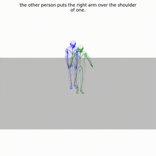 | 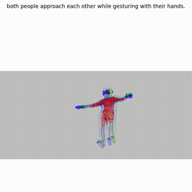 | 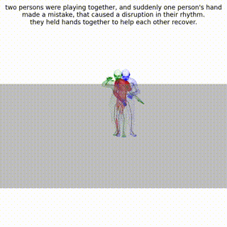 | 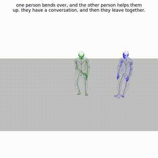 |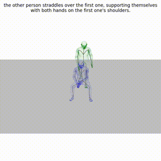 | 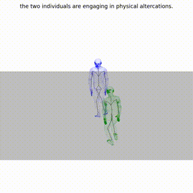 | 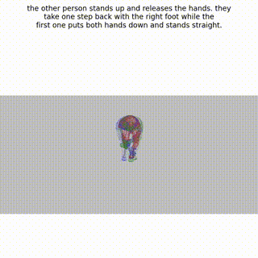 |
|  |  | 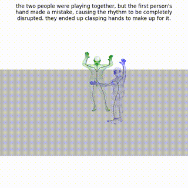 | 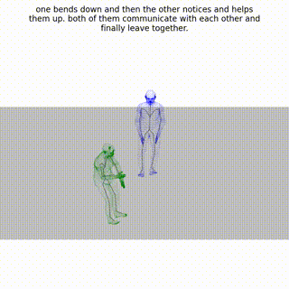 |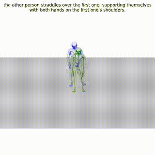 | 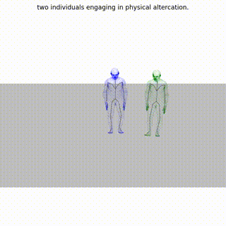 | 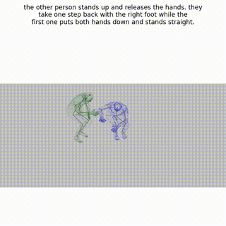 |
| **Ours** | **Ours** | **Ours** | **Ours** | **Ours** | **Ours** | **Ours** |

</div>

PhysiGen significantly reduces interpenetration while maintaining semantic consistency with the text prompt. Red dashed boxes highlight severe collision artifacts in baseline methods.


### Computational Cost

| Method | Memory (MB) | Time per batch (s) |
|---|---|---|
| Baseline | 15,107 | — |
| PhysiGen (50×19 pts) | 20,219 | **0.053** |
| SDF Loss (128 pts) | 24,152 | 0.352 |
| SDF Loss (6890 pts) | 24,156 | 3.734 |
pts means the num of the points.
---

## 📄 Citation

If you find this work useful, please consider citing:

```bibtex
@article{Lei2026PhysigenIC,
  title={Physigen: Integrating Collision-Aware Physical Constraints for High-Fidelity Human-Human Interaction Generation},
  author={Nan Lei and Yuan-Ming Li and Ling-an Zeng and Liangliang Xu and Zhi-Wei Xia and Huihui Huang and Fa-Ting Hong and Wei-Shi Zheng},
  journal={ICASSP 2026 - 2026 IEEE International Conference on Acoustics, Speech and Signal Processing (ICASSP)},
  year={2026},
  url={https://api.semanticscholar.org/CorpusID:287685790}
}
```

---

## 📜 License

This project is released under the [Apache License 2.0](LICENSE).

---

## 🙏 Acknowledgement

We thank the following open-source projects for their contributions:

- [InterGen](https://github.com/tr3e/InterGen) — two-person interaction generation framework and InterHuman dataset
- [Inter-X](https://github.com/liangxuy/Inter-X) — large-scale human interaction dataset
- [in2IN](https://github.com/pabloruizponce/in2IN) — individual-aware interaction generation
- [TIMotion](https://github.com/AIGC-Explorer/TIMotion) — temporal and interactive motion generation framework
- [multiperson](https://github.com/JiangWenPL/multiperson) — SDF-based loss implementation

---

<div align="center">
<sup>If you have any questions, please open an issue or contact us at lein7@mail2.sysu.edu.cn</sup>
</div>